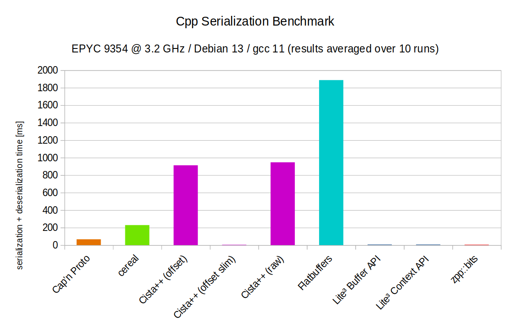

# Cpp Serialization Benchmark
This repository has been forked from [the original](https://github.com/felixguendling/cpp-serialization-benchmark) to add the Lite³ format to the benchmarks.



| Name                  | Serialize + Deserialize | Deserialize | Serialize   | Traverse    | Deserialize and traverse | Message size    |
| --------------------- |------------------------ | ----------- | ----------- | ----------- | ------------------------ | --------------- |
| Cap’n Proto           | **66.55 ms**            | 0 ms        | 66.55 ms    | 210.1 ms    | 211 ms                   | 50.5093 MB      |
| cereal                | **229.16 ms**           | 98.76 ms    | 130.4 ms    | 79.17 ms    | 180.7 ms                 | 37.829 MB       |
| Cista++ (offset)      | **913.2 ms**            | 274.1 ms    | 639.1 ms    | 79.59 ms    | 80.02 ms                 | 176.378 MB      |
| Cista++ (offset slim) | **3.96 ms**             | 0.17 ms     | 3.79 ms     | 79.99 ms    | 80.46 ms                 | 25.317 MB       |
| Cista++ (raw)         | **947.4 ms**            | 289.2 ms    | 658.2 ms    | 81.53 ms    | 113.3 ms                 | 176.378 MB      |
| Flatbuffers           | **1887.49 ms**          | 41.69 ms    | 1845.8 ms   | 90.53 ms    | 90.35 ms                 | 62.998 MB       |
| Lite³ Buffer API      | **7.79 ms**             | 4.77 ms     | 3.02 ms     | 79.39 ms    | 84.92 ms                 | 38.069 MB       |
| Lite³ Context API     | **7.8 ms**              | 4.76 ms     | 3.04  ms    | 79.59 ms    | 84.13 ms                 | 38.069 MB       |
| zpp::bits             | **4.66 ms**             | 1.9 ms      | 2.76 ms     | 78.66 ms    | 81.21 ms                 | 37.8066 MB      |

Benchmark data:
- [cpp_serialization_benchmark_output.txt](cpp_serialization_benchmark_output.txt)
- [cpp_serialization.csv](cpp_serialization.csv)

This benchmark requires that `g++-11` be installed:
```bash
sudo apt update
sudo apt install g++-11
```
To replicate this benchmark, run:
```bash
git clone https://github.com/felixguendling/cpp-serialization-benchmark.git
cd cpp-serialization-benchmark/
git submodule update --init --recursive
mkdir build
cd build
export CXX=/usr/bin/g++-11
cmake -DCMAKE_BUILD_TYPE=Release ..
make
```
A single benchmark run can now be performed like so:
```bash
./cpp-serialization-benchmark
```
However to produce more consistent results, CPU frequency scaling should first be disabled to minimize variance:
```bash
apt update
apt install linux-cpupower
cpupower frequency-set -g performance
cpupower frequency-info
```
You should see:
        
        The governor "performance" may decide which speed to use

The OS can also introduce variance by inconsistent scheduling of threads across NUMA-domains.
To prevent this, the process and memory should be pinned.
Also, not one but multiple runs will increase the consistency of the results.

This command will perform 10 benchmark runs and write the results to `output.txt`:
```bash
lscpu >> output.txt && \
numactl -H >> output.txt && \
numactl --cpunodebind=0 --membind=0 ./cpp-serialization-benchmark >> output.txt && \
numactl --cpunodebind=0 --membind=0 ./cpp-serialization-benchmark >> output.txt && \
numactl --cpunodebind=0 --membind=0 ./cpp-serialization-benchmark >> output.txt && \
numactl --cpunodebind=0 --membind=0 ./cpp-serialization-benchmark >> output.txt && \
numactl --cpunodebind=0 --membind=0 ./cpp-serialization-benchmark >> output.txt && \
numactl --cpunodebind=0 --membind=0 ./cpp-serialization-benchmark >> output.txt && \
numactl --cpunodebind=0 --membind=0 ./cpp-serialization-benchmark >> output.txt && \
numactl --cpunodebind=0 --membind=0 ./cpp-serialization-benchmark >> output.txt && \
numactl --cpunodebind=0 --membind=0 ./cpp-serialization-benchmark >> output.txt && \
numactl --cpunodebind=0 --membind=0 ./cpp-serialization-benchmark >> output.txt
```


# Original README:

# C++ Serialization Benchmark  [](https://travis-ci.org/felixguendling/cpp-serialization-benchmark)

This benchmark suite accompanies the public release of the [Cista++](https://cista.rocks/) serialization library.

This repository contains benchmarks for C++ (binary & high performance) serialization libraries.
The goal was to create a benchmark based on a non-trivial data structure.
In this case, we serialize, deserialize and traverse a graph (nodes and edges).
Since the goal was to have a data structure containing pointers, we choose an "object oriented" representation of a graph instead of a simple adjacency matrix.
Some frameworks do no support cyclic data structures. Thus, instead of having node pointers in the edge object, we just reference start and destination node by their index.
Benchmarks are based on the [Google Benchmark](https://github.com/google/benchmark) framework.

This repository compares the following C++ binary serialization libraries:

  - [Cap’n Proto](https://capnproto.org/capnp-tool.html)
  - [cereal](https://uscilab.github.io/cereal/index.html)
  - [Flatbuffers](https://google.github.io/flatbuffers/)
  - [Cista++](https://cista.rocks/)


# Other Benchmarks

  - Benchmarks de/serialization (Thrift, Protobuf, Boost.Serialization, Msgpack, Cereal, Avro, Capnproto, Flatbuffers, YAS) of [two arrays (numbers and strings)](https://github.com/thekvs/cpp-serializers/blob/master/test.fbs): https://github.com/thekvs/cpp-serializers
  - Rust de/serialization benchmarks (Cap’n Proto vs. Protocol Buffers): https://github.com/ChrisMacNaughton/proto_benchmarks
  - FlatBuffers benchmarks: https://google.github.io/flatbuffers/flatbuffers_benchmarks.html


# Build & Execute

To run the benchmarks you need a C++17 compatible compiler and CMake. Tested on Mac OS X (but Linux should be fine, too).

    git clone --recursive github.com:felixguendling/cpp-serialization-benchmark.git
    cd cpp-serialization-benchmark
    mkdir build
    cd build
    cmake -DCMAKE_BUILD_TYPE=Release ..
    make
    ./cpp-serialization-benchmark


# Results

| Library                                               | Serialize      | Deserialize     | Fast Deserialize |   Traverse | Deserialize & Traverse |      Size  |
| :---                                                  |           ---: |            ---: |             ---: |       ---: |                   ---: |       ---: |
| [Cap’n Proto](https://capnproto.org/capnp-tool.html)  |        76 ms   |    **0.00 ms**  |       **0.0 ms** |   216 ms   |               221 ms   |    50.5M   |
| [cereal](https://uscilab.github.io/cereal/index.html) |       216 ms   |    111.00 ms    |                - |   67 ms    |               174 ms   |    37.8M   |
| [Cista++](https://cista.rocks/) `offset`              |      **4 ms**  |      0.16 ms    |       **0.0 ms** |   67 ms    |             **66 ms**  |  **25.3M** |
| [Cista++](https://cista.rocks/) `raw`                 |       650 ms   |     24.80 ms    |        24.8 ms   |   66 ms    |               91 ms    |   176.4M   |
| [Flatbuffers](https://google.github.io/flatbuffers/)  |      1409 ms   |     35.70 ms    |       **0.0 ms** |   75 ms    |               75 ms    |    63.0M   |
| [zpp_bits](https://github.com/eyalz800/zpp_bits)      |      **4 ms**  |      6.58 ms    |           6.6 ms | **65 ms**  |               72 ms    |    37.8M   |

Cista++ `offset` describes the "slim" variant (where the edges use indices to reference source and target node instead of pointers).

Exact results can be found [here](https://github.com/felixguendling/cpp-serialization-benchmark/blob/master/benchmark_result.txt).

Benchmarks were run on Ubuntu 20.04 on an AMD Ryzen 9 5900X, compiled with GCC 11.


## Compilation Times

Compilation times are measured with code generation but without building the code generators or static libraries (Cap’n Proto, Flatbuffers).

| Library                                               | clang-7 on Mac OS X |
| :---                                                  |                ---: |
| [Cap’n Proto](https://capnproto.org/capnp-tool.html)  |              0.440s |
| [cereal](https://uscilab.github.io/cereal/index.html) |              1.827s |
| [Cista++](https://cista.rocks/) `raw`                 |              1.351s |
| [Flatbuffers](https://google.github.io/flatbuffers/)  |              0.857s |


# Contribute

You have found a mistake/bug or want to contribute new benchmarks? Feel free to open an issue/pull request! :smiley:
